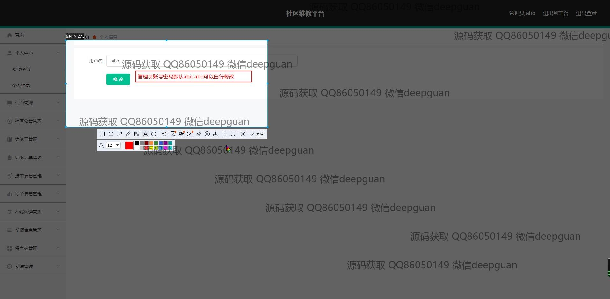

<h1 align="center">的社区维修平台</h1>

## 简介
社区维修平台：基于Spring Boot开发，角色分为管理员和用户；提供社区公告管理、维修订单管理、消息通知、在线沟通和用户信息管理等功能，提升社区服务效率和用户体验。    --计算机毕业设计源码；毕设源码；java毕业设计源码

## 联系方式

<h3 align="center">获取完整代码与数据库文件 + 微信：deepguan QQ: 86050149 QQ群: 783742310</h3>

<h3 align="center">可帮忙远程部署 包运行成功！提供远程部署、修改代码、设计文档指导、代码讲解等服务！</h3>

## 功能介绍（完整见运行截图）
管理员：基本功能包括登录、注册和退出。网站首页设有导航栏，便于访问社区公告、维修订单、新闻资讯、留言反馈、个人中心和后台管理。公告管理允许编辑和发布社区公告。维修管理涉及订单的创建及管理。系统管理支持用户信息修改和密码重置。后台还提供在线沟通与举报信息处理，确保社区事务的顺畅处理。

用户：注册可以创建新账户，为维修服务的申请和管理做准备。通过个人中心，用户能够查看和编辑个人信息，提交或查看维修订单，选择维修人员，评价服务并进行在线支付。系统支持上传故障图片和附加订单详情信息，利用文本编辑器对维修内容进行详细描述。用户界面的设计则帮助在各大模块间便捷切换，确保用户高效操纵基本功能。

## 运行截图

本代码来源于网络,仅供学习参考使用!

